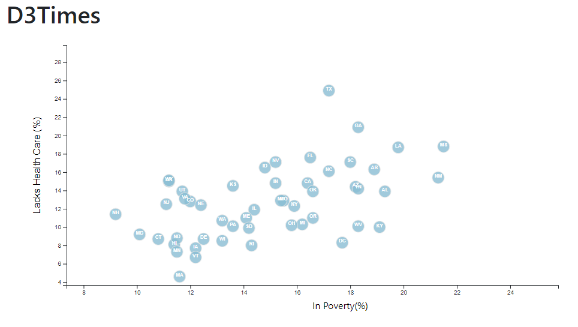
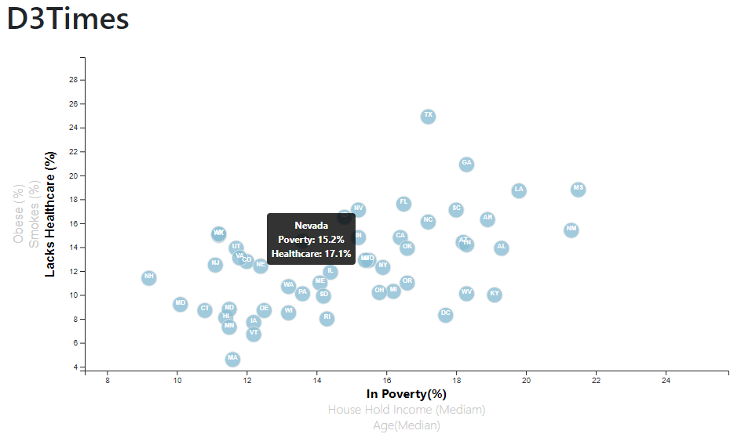

# D3-Challenge
D3 Homework - Data Journalism and D3

## Background

Welcome to the newsroom! You've just accepted a data visualization position for a major metro paper. You're tasked with analyzing the current trends shaping people's lives, as well as creating charts, graphs, and interactive elements to help readers understand your findings.

The editor wants to run a series of feature stories about the health risks facing particular demographics. She's counting on you to sniff out the first story idea by sifting through information from the U.S. Census Bureau and the Behavioral Risk Factor Surveillance System.

The data set included is based on 2014 ACS 1-year estimates from the [US Census Bureau](https://data.census.gov/cedsci/).The current data set includes data on rates of income, obesity, poverty, etc. by state. MOE stands for "margin of error."

## Your Task

### D3 Dabbler (Required Assignment)

You need to create a scatter plot between two of the data variables such as `Healthcare vs. Poverty`.
Using the D3 techniques we taught you in class, create a scatter plot that represents each state with circle elements.

### Impress the Boss

Why make a static graphic when D3 lets you interact with your data?

#### 1. More Data, More Dynamics

You're going to include more demographics and more risk factors. Place additional labels in your scatter plot and give them click events so that your users can decide which data to display. Animate the transitions for your circles' locations as well as the range of your axes. Do this for two risk factors for each axis. Or, for an extreme challenge, create three for each axis.

#### 2. Incorporate d3-tip

While the ticks on the axes allow us to infer approximate values for each circle, it's impossible to determine the true value without adding another layer of data. Enter tooltips: developers can implement these in their D3 graphics to reveal a specific element's data when the user hovers their cursor over the element. Add tooltips to your circles and display each tooltip with the data that the user has selected.

